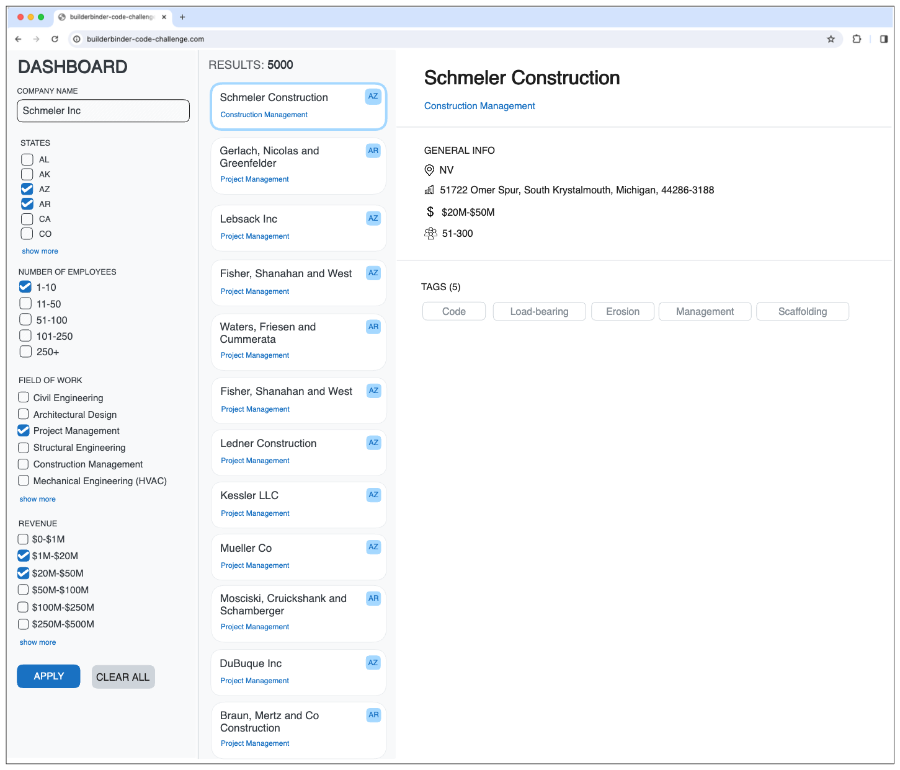

# SWE Tech Challenge 👨🏽‍💻
Technical challenge for SWE position at Builderbinder.com

# Overview 🔎
Welcome to the Full-Stack Software Engineer Code Challenge! Please follow the instructions carefully and complete the tasks outlined below.

We would like you to create a full-stack application that displays search results from a database of half million companies. Using filters, the user should be able to find companies that match the search criteria and get its details.

> 👉 N.b.: for all the tasks, consider the following boundary conditions of the companies dataset (link available in the Backend section):
- states are all 50 from US and are used abbreviated
- number of employees are 4 ranges:
    - "1-10"
    - "11-50"
    - "51-100"
    - "101-250"
    - "250+"
- field of work is a list of 10 items:
    - "Civil Engineering",
    - "Architectural Design"
    - "Project Management"
    - "Structural Engineering"
    - "Construction Management"
    - "Mechanical Engineering (HVAC)"
    - "Electrical Engineering"
    - "Surveying"
    - "Environmental Engineering"
    - "Construction Estimating"
- revenue are within 8 ranges:
    - "$0-$1M",
    - "$1M-$20M",
    - "$20M-$50M",
    - "$50M-$100M",
    - "$100M-$250M",
    - "$250M-$500M",
    - "$500M-$1B",
    - "$1B+",

## PART 1: Front-end (3h) 🖥️
You should finish the app in the `frontend` folder using React. Part of the code is already done: project setup and the main view, it's your task to add more details, making it look like the wireframes (they are in the `assets` folders and referenced below), impelement and consume the API that will be developed in the second part of this test.

### User stories & Wireframe 🖼️
Below we have the wireframes and a couple of users stories that should be implemented in the app. Don't forget the empty states!

1. The user will be able to search companies using the following filters:
    - company's name
    - address
    - state
    - number of employees
    - field of work
    - revenue

2. The user will have a list of matching companies after applying the filters. The list should be sorted by "best match". The number of companies matched should be displayed. Consider "best match" as the list of companies that are nearest to the selected filters. For example, if the user searches by company name "Conroy", it should list all the companies that has this term in its name ordered by similarity.

3. When the user clicks in one of the listed companies, the details of the company should be shown on the right-hand panel where it reads "SELECT A COMPANY" (the empty-state message should be replaced by the company's details).

4. Bonus item: the user should be able to select companies in the list and be able to export all the information to a CSV file.

5. Bonus item: README explaining the architectural decisions, folder structure and etc.

6. Bonus item: a11y

Feel free to use any UI libraries to build the application. But be aware of the size of the "production" application.

### Evaluation criteria 🧪
- fidelity of the implemented UI to the wireframes
- use of types
- code organization and cleanliness (try applying some principles such as [DRY](https://www.mohammadfaisal.dev/blog/5-dry-principles-to-follow-in-react), [SOLID](https://konstantinlebedev.com/solid-in-react/) and [DDD](https://well-thought.tech/scale-up-your-react-application-with-ddd/))
- performance
- tests suite

## PART 2: Back-end (2h) 🖲️
You should create an app, preferably in PHP Laravel or Java Spring Boot (but you are free to pick the language and framework), that will act as an API for the UI built in the previous task. It must have at least one endpoint that will return the results of the company search.

### Database 🗄️
The database should be PostgreSQL, but you are also free to choose the DBMS. [In this link there is a CSV file with 1M rows](https://bb-general-purpose.s3.amazonaws.com/swe-tech-challenge/sample_companies.csv) that represents the companies in the database. All the data was created using the [javascript Faker library](https://fakerjs.dev/). You should download this file and seed the app's database with it. Feel free to model the tables as you wish.

Basically, in this CSV you will have the columns

- company_name
- address
- state
- number_of_employees
- field_of_work
- avg_revenue
- tags

that are almost the fields the user should be able to search, except the `tags` column.

Also, a `docker-compose.yml` file with a PostgreSQL is provided in the `backend` folder for start. Of course, if you choose not to use PostgreSQL, you will need to change the docker-compose.

Bonus item: README explaining the architectural decisions, folder structure and etc.

> 👉 N.b.: When pushing the code to Github, you don't need to upload the company CSV file, we will seed it in our end when testing, but instructions must be clear on how to seed it to the DB.

### Evaluation criteria 🧪
- dockerization
- architectural decisions (endpoints, folder structure, design patterns, etc)
- design of the database
- code organization and cleanliness
- endpoint performance: even dockerized, the endpoints should not take longer than 30s to return
- tests suite

## PART 3: integration and documentation (30m) 🤝
After finishing PART 1 and 2, you should integrate the back-end into the front-end app and document how to run both apps integrated

### Evaluation criteria 🧪
- clarity and completeness of the documentation on running both applications together

## Submission 📬
After finishing the challenge, push it to a Github repo and send the link to aravazzi[at]builderbinder.com with the title "SWE Tech Challenge".

Good luck! 🤞🍀
